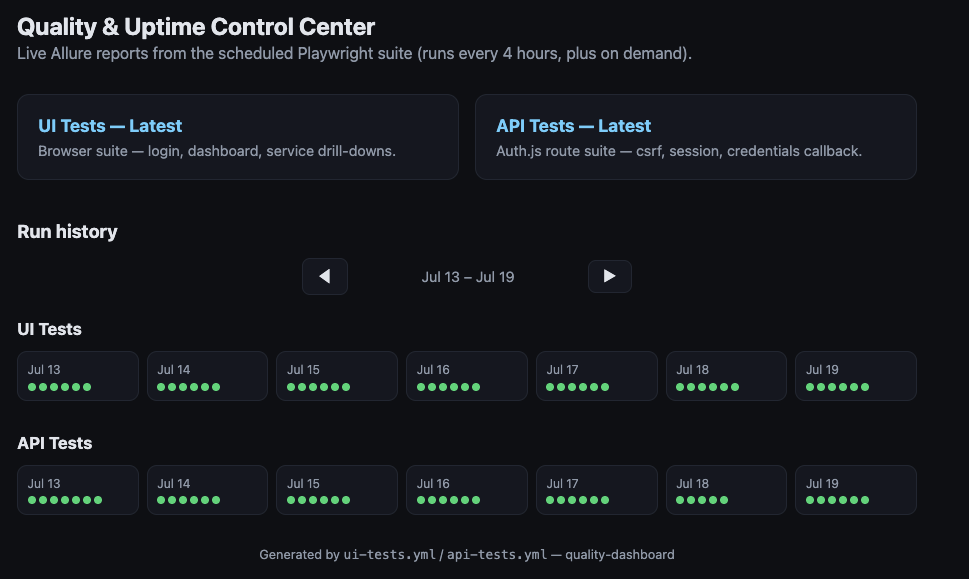

# Quality & Uptime Control Center

[](https://github.com/cloffwang/quality-dashboard/actions/workflows/ui-tests.yml)
[](https://github.com/cloffwang/quality-dashboard/actions/workflows/api-tests.yml)

A portfolio project: a mock "Quality & Uptime Control Center" status dashboard, paired
with a Playwright test suite that exercises it end-to-end. Built to demonstrate SDET
skills — test design and automation against a realistic app, not just unit tests against
toy functions. Three things it's meant to show:

1. **A bird's-eye view of test health, not just pass/fail noise.** The
   [live report's weekly calendar](https://cloffwang.github.io/quality-dashboard/) lays
   out every run, across both the UI and API suites, by day — the kind of at-a-glance
   status an SDET or engineering manager actually wants, rather than digging through
   individual CI logs one run at a time.

   

2. **Tests are organized into independent modules, one per feature area** — `ui/` and
   `api/` as top-level suites, and within each, one spec set per domain (frontend smoke,
   backend API, ETL, MCP). That separation is what lets the suite report status per
   feature instead of one monolithic pass/fail, and the same pattern (a Playwright
   project + page objects per area) scales cleanly to more services — more backend APIs,
   more microservices — without restructuring the suite each time one gets added.
3. **Test logic is isolated from environment.** The exact same spec files run unmodified
   against `prod` and `stage` — everything environment-specific (base URL, staging
   banner, title copy) is injected through one shared fixture rather than forked test
   files, so pointing the suite at a new environment is a config change, not a rewrite.

The dashboard itself reports health for four operational domains, each backed entirely by
mock data so both a healthy and a degraded state can be demonstrated on demand:

- **Frontend Smoke Tests** — 48h heartbeat strip, run history, failure stack traces
- **Backend/Gateway API** — error rate, P95 latency, latency trend chart
- **ETL Pipelines** — weekly run calendar, rows processed, data-quality quarantine log
- **MCP Protocol Services** — token throughput, tool invocation success rate, live feed

Which state you see is driven by which mock account you log in as
(`ok@example.com` → healthy, `outage@example.com` → degraded/outage) — see
[dashboard-server/README.md](dashboard-server/README.md) for credentials and setup, and
[tests/README.md](tests/README.md) for running the test suite.

## Live Allure reports

The `ui-tests` and `api-tests` workflows publish live Allure reports to GitHub Pages, two
ways to reach them:

- **Latest run, one click:** https://cloffwang.github.io/quality-dashboard/ui-report/ and
  .../api-report/ always redirect to the most recent report.
- **Weekly calendar, for browsing history:** the
  [landing page](https://cloffwang.github.io/quality-dashboard/) itself — every day's
  runs, UI and API tracked separately, each linking straight to that run's own report.

## Structure

```
dashboard-server/   Next.js 14+ App Router app — the dashboard itself, fully mocked
tests/              Playwright (TypeScript) suite — page objects, per-mock-user auth
                    setup, ui/ and api/ specs, prod/stage env fixtures — runs against
                    the launched server(s)
.github/workflows/  CI on every PR + scheduled (every 4 hours) — publishes Allure reports
```

## Status

- `dashboard-server/` — built and verified; runs as `prod` and `stage` environments.
- `tests/` — backbone built and verified (page objects, auth setup, example specs across
  ui/ and api/), parameterized to run against both `prod` and `stage`.
- GitHub Actions CI — `ui-tests`/`api-tests` run on every PR and on a schedule, publishing
  live Allure reports to GitHub Pages (badges above).

## License

MIT — see [LICENSE](LICENSE).
